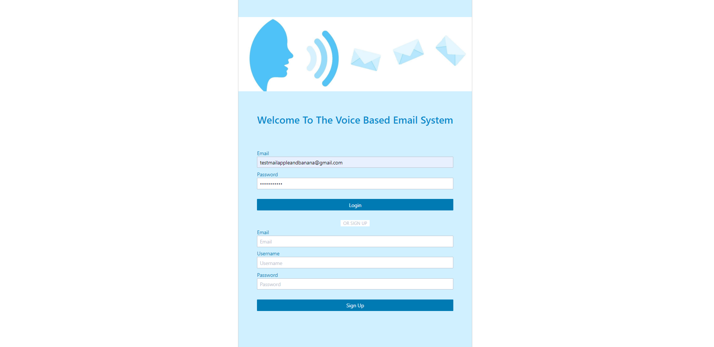
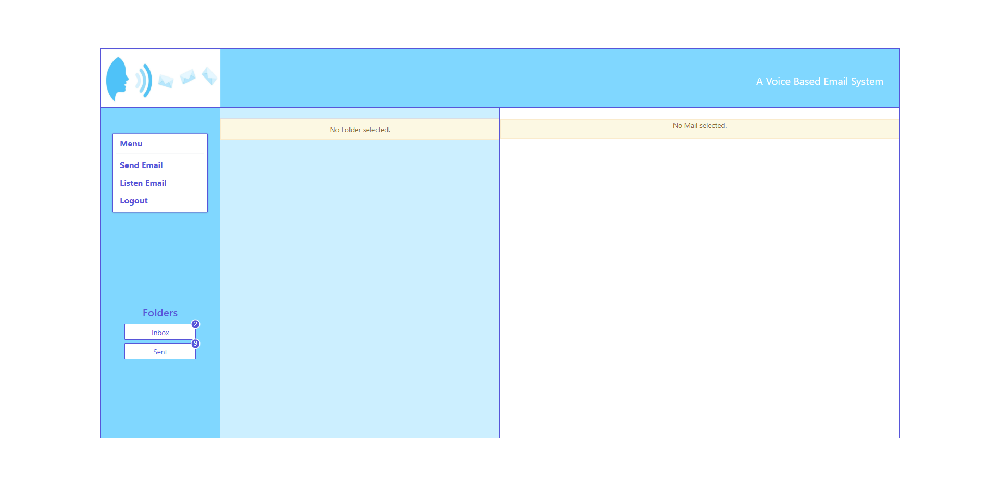
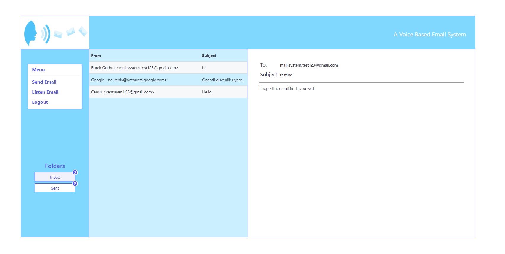
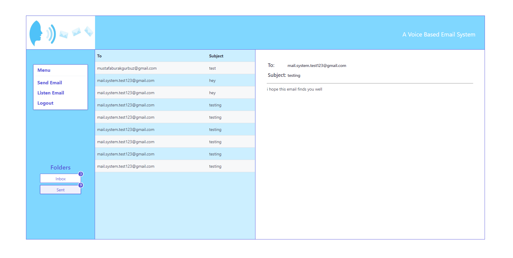
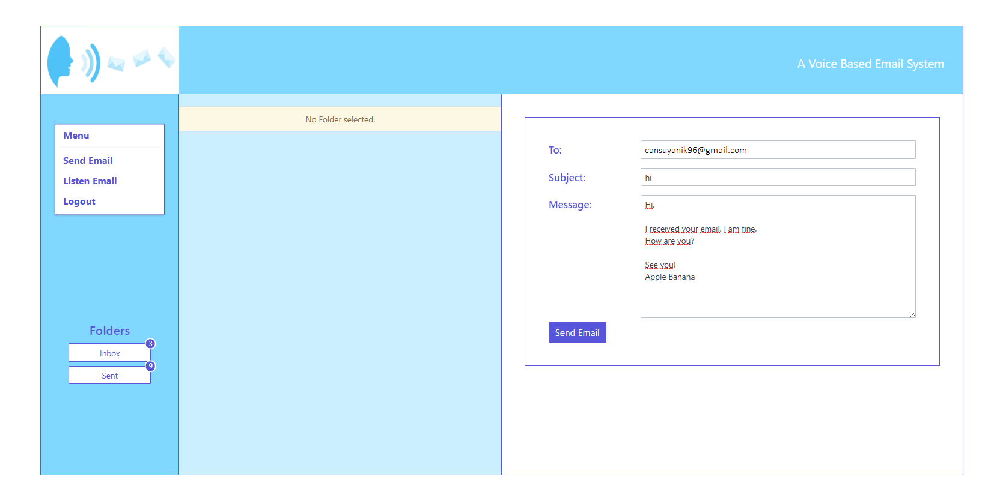

# Voice-Based-Email-System
Voice based email system for visually impaired people

We live with disabled people around us. For them, life is full of obstacles. Some efforts are being made to make the lives of people with disabilities easier. For these people, special technologies are being produced, or new features are added to existing technologies. This has started to appear in web and mobile applications. Mobile and web applications should be made available to every kind of people, including people with disabilities.

The aim of this project comes from this. In this project, it is planned to create a voice-based email system for visually impaired people. This email system will be a web-based application and used to detect and process users' voices. The functions that the application will have given below:

- Sending email: The application will record the user's voice and convert it into text.
- Receiving email: The application will convert the received email from text to voice.
- Menu: The application will have a menu that contains the functions it has. Thus, users can select the actions they want to do by using the menu.
- Interface: In addition, the application will have an interface designed to send and receive emails.

The application must have some capabilities to perform these actions. For example, for sending or receiving mail, speech to text conversion, text to speech conversion and audio
playback; and for selecting options from the menu, some trigger mechanism or keyword recognition process will be necessary.

## Screenshots from the application:
### Login Page

### Home Page

### Inbox Page

### Sent Page

### Send Email Page

